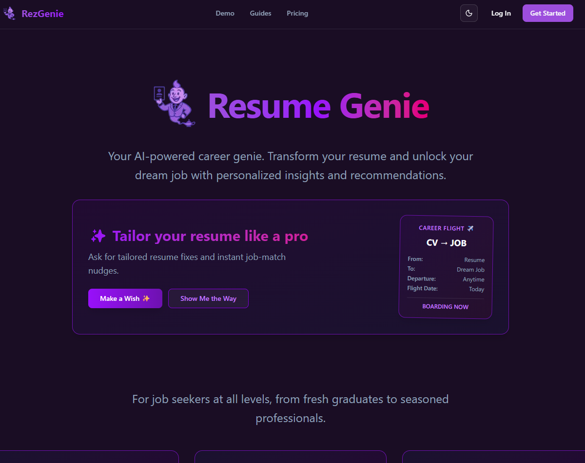
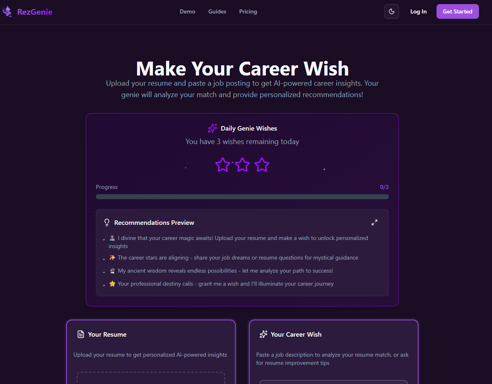
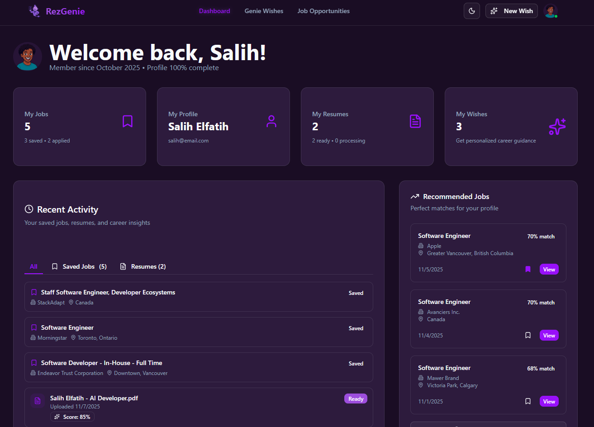

# 🧞‍♂️ RezGenie

[](https://opensource.org/licenses/MIT)
[](https://www.python.org/downloads/)
[](https://nextjs.org/)
[](https://fastapi.tiangolo.com/)

> AI-powered resume optimization platform that helps job seekers land their dream jobs

## 📑 Table of Contents

- 🎯 [Project Overview](#-project-overview)
- ✨ [Key Features](#-key-features)
- 👯 [Team](#-team)
- 🛠️ [Technology Stack](#️-technology-stack)
- 🎯 [Project Structure](#️-project-structure)
- 🚀 [Quick Start](#-quick-start)
- 📚 [Documentation](#-documentation)
- 🗺️ [Application Structure](#️-application-structure)
- 🤝 [Contributing](#-contributing)
- 📄 [License](#-license)
- 🌟 [Acknowledgments](#-acknowledgments)

## 🎯 Project Overview

RezGenie is an intelligent resume analysis and optimization platform that leverages AI to help job seekers improve their resumes and increase their chances of landing interviews. Our AI genie provides personalized recommendations, skill gap analysis, and job matching insights.

## ✨ Key Features

- **Smart Resume Analysis**: AI-powered parsing and analysis of resume content
- **Job Matching**: Intelligent matching between resumes and job postings
- **Skill Gap Identification**: Identifies missing skills and provides learning recommendations  
- **ATS Optimization**: Ensures resumes are optimized for Applicant Tracking Systems
- **Interview Preparation**: Tailored advice for interview success
- **Career Guidance**: Personalized career path recommendations

## 👯 Team

- **AI/ML Engineer**: Yaqin Albirawi [(@yalbirawi)](https://github.com/yalbirawi) - Machine learning models, natural language processing
- **Backend Lead**: Salih Elfatih [(@salihelfatih)](https://github.com/salihelfatih) - API architecture, AI integration, database design
- **DevOps Engineer**: David Lee [(@dle519)](https://github.com/dle519) - Cloud infrastructure, CI/CD, deployment automation
- **Frontend Lead**: Andy Pham [(@AndyPham2341)](https://github.com/AndyPham2341) - User interface, user experience, responsive design

## 🛠️ Technology Stack

### Backend

- **Framework**: FastAPI (Python) with async support
- **Database**: PostgreSQL 16 with pgvector extension
- **AI/ML**: OpenAI GPT-4, embeddings, spaCy NLP
- **Authentication**: JWT with advanced security features
- **Background Tasks**: Celery with Redis
- **Storage**: MinIO S3-compatible storage

### Frontend

- **Framework**: Next.js 14 with App Router & TypeScript
- **Styling**: Tailwind CSS with dark/light mode, purple theme
- **UI Components**: shadcn/ui component library
- **Animations**: Framer Motion for smooth transitions
- **State Management**: React Query for API state management
- **Form Handling**: React Hook Form with Zod validation

### Infrastructure

- **Containerization**: Docker & Docker Compose
- **Monitoring**: Comprehensive logging and health checks
- **Documentation**: Automated API documentation

## 🏗️ Project Structure

```plaintext
RezGenie/
├── backend/                # FastAPI backend application
├── frontend/               # React frontend
├── scripts/                # Utility scripts for setup and deployment
├── docker-compose.yml      # Development environment setup
└── docs/                   # Project documentation
```

## 🚀 Quick Start

### Prerequisites

- Docker and Docker Compose
- Git

### Development Setup

1. **Clone the repository**

   ```bash
   git clone https://github.com/RezGenie/ResumeGenie.git
   cd ResumeGenie
   ```

2. **Set up environment variables**

   ```bash
   # Copy example environment file
   cp backend/.env.example backend/.env
   # Edit backend/.env with your API keys and configuration
   ```

3. **Start the development environment**

   ```bash
   # Start all services
   docker-compose up -d
   
   # View logs
   docker-compose logs -f
   ```

4. **Access the application**
   - **API Documentation**: <http://localhost:8000/docs>
   - **Frontend**: <http://localhost:3000>
   - **MinIO Console**: <http://localhost:9001>

## 📚 Documentation

### Core Documentation
- 📖 [Complete Setup Guide](docs/setup.md) - Development environment setup
- 🧪 [Testing Guide](docs/testing.md) - Testing procedures and checklist
- 🚀 [Deployment Guide](docs/deployment.md) - Production deployment options
- 📦 [Changelog](docs/CHANGELOG.md) - Version history and features

### Technical Documentation
- 🍑 [Backend Documentation](backend/README.md) - API architecture and endpoints
- 🖼️ [Frontend Documentation](frontend/README.md) - UI/UX and component library
- 🏗️ [Design Document](docs/design.md) - System architecture and data models
- 🗄️ [Database Schema](docs/database.md) - Database design and models

### Project Management
- 📋 [Requirements](docs/requirements.md) - Functional requirements and user stories
- ✅ [Task Tracking](docs/tasks.md) - Implementation progress
- 🎓 [Academic Context](docs/academic.md) - Capstone project information  

## 🗺️ Application Structure

### Frontend (Next.js 14)

Modern, responsive web application with comprehensive UI/UX:

- **Landing & Auth**: Hero page, login/signup with secure authentication
- **Core Features**: AI genie interface, opportunities matching, user dashboard  
- **Career Hub**: Comprehensive guides for resume optimization and job search
- **User Management**: Profile settings, preferences, and account management
- **Legal Pages**: Privacy policy, terms of service, contact information

### Design System

- **Purple Theme**: Professional gradient color scheme with dark/light mode
- **Responsive Design**: Mobile-first approach optimized for all devices
- **Smooth Animations**: Framer Motion powered transitions and micro-interactions
- **Component Library**: shadcn/ui components with consistent design patterns

## 🤝 Contributing

1. Fork the repository
2. Create a feature branch (`git checkout -b feature/amazing-feature`)
3. Make your changes following the established patterns
4. Add tests for new functionality
5. Commit your changes (`git commit -m 'Add some amazing feature'`)
6. Push to the branch (`git push origin feature/amazing-feature`)
7. Open a Pull Request

## 📸 Screenshots

### Landing Page


### AI Genie Interface


### Dashboard


## 📄 License

This project is licensed under the MIT License - see the [LICENSE](LICENSE) file for details.

## 🌟 Acknowledgments

- OpenAI for providing powerful AI models and embeddings
- FastAPI community for the excellent async framework
- PostgreSQL and pgvector for vector similarity search
- All contributors who help make RezGenie better

---

Built with 💖 by the RezGenie team
