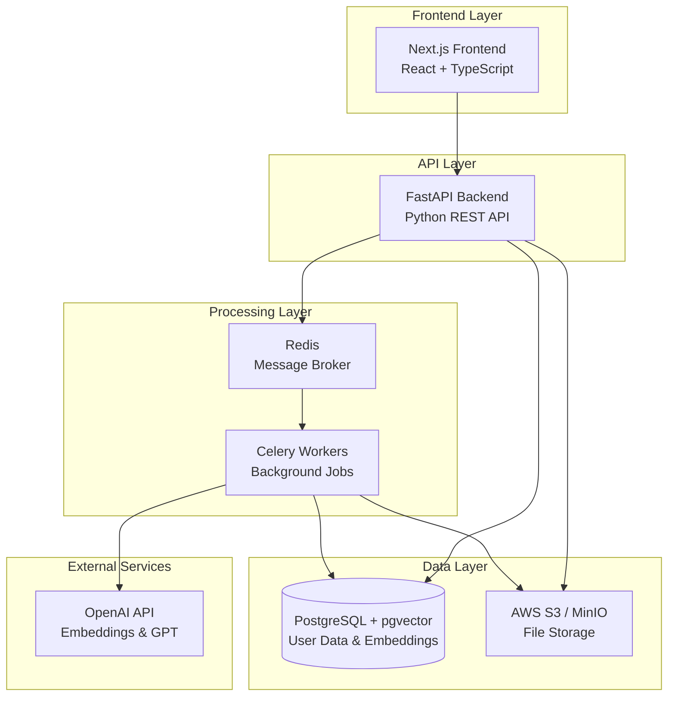

# 🏗️ RezGenie Design Document

## Overview

RezGenie is a microservices-based AI-powered resume optimization platform built with a modern tech stack. The system uses semantic analysis and machine learning to provide personalized resume improvement recommendations through an intuitive web interface.

### Key Design Principles

- **Scalability**: Asynchronous processing with Celery workers for AI operations
- **Performance**: Vector database optimization with pgvector for fast similarity searches
- **Security**: JWT-based authentication with secure file handling
- **User Experience**: Real-time feedback and responsive UI with loading states
- **Modularity**: Clean separation between frontend, backend, and worker services

## Architecture

### System Architecture Diagram



### Technology Stack

**Frontend:**

- Next.js 14 with App Router for SSR and client-side routing
- React 18 with TypeScript for type safety
- Tailwind CSS for responsive styling
- React Query for API state management and caching
- React Hook Form for form validation

**Backend:**

- FastAPI with Pydantic for API validation and documentation
- SQLAlchemy 2.0 with async support for database ORM
- Alembic for database migrations
- python-jose for JWT token handling
- python-multipart for file upload handling

**Workers & Queue:**

- Celery 5.x for distributed task processing
- Redis as message broker and result backend
- Flower for monitoring Celery tasks

**Database & Storage:**

- PostgreSQL 15+ with pgvector extension for vector operations
- AWS S3 for production file storage
- MinIO for local development file storage

**AI & ML:**

- OpenAI API for embeddings (text-embedding-3-small) and text generation (GPT-4)
- spaCy for text preprocessing and NLP
- scikit-learn for additional ML utilities

## Components and Interfaces

### Frontend Components

#### Authentication Components

```typescript
// components/auth/LoginForm.tsx
interface LoginFormProps {
  onSuccess: (token: string) => void;
  onError: (error: string) => void;
}

// components/auth/RegisterForm.tsx
interface RegisterFormProps {
  onSuccess: (token: string) => void;
  onError: (error: string) => void;
}
```

#### Resume Management Components

```typescript
// components/resume/ResumeUpload.tsx
interface ResumeUploadProps {
  onUploadSuccess: (resumeId: string) => void;
  onUploadProgress: (progress: number) => void;
  maxFileSize: number; // 10MB
  acceptedFormats: string[]; // ['pdf', 'docx']
}

// components/resume/ResumeAnalysis.tsx
interface ResumeAnalysisProps {
  resumeId: string;
  analysisData: ResumeAnalysis;
  isLoading: boolean;
}
```

#### Job Comparison Components

```typescript
// components/jobs/JobComparisonForm.tsx
interface JobComparisonFormProps {
  resumeId: string;
  onComparisonComplete: (result: ComparisonResult) => void;
}

// components/jobs/ComparisonResults.tsx
interface ComparisonResultsProps {
  similarityScore: number;
  missingSkills: string[];
  matchedSkills: string[];
  recommendations: string[];
}
```

#### Genie Wishes Components

```typescript
// components/genie/GenieWishPanel.tsx
interface GenieWishPanelProps {
  remainingWishes: number;
  onWishMade: (wish: string) => void;
  wishHistory: GenieWish[];
}
```

### Backend API Endpoints

#### Authentication Endpoints

```python
# /auth/register
POST /api/v1/auth/register
Request: { email: str, password: str, confirm_password: str }
Response: { access_token: str, token_type: str, user_id: str }

# /auth/login
POST /api/v1/auth/login
Request: { email: str, password: str }
Response: { access_token: str, token_type: str, user_id: str }

# /auth/refresh
POST /api/v1/auth/refresh
Headers: { Authorization: "Bearer <token>" }
Response: { access_token: str, token_type: str }
```

#### Resume Management Endpoints

```python
# Upload resume
POST /api/v1/resumes/upload
Headers: { Authorization: "Bearer <token>" }
Request: multipart/form-data with file
Response: { resume_id: str, status: str, job_id: str }

# Get resume status
GET /api/v1/resumes/{resume_id}/status
Response: { status: str, progress: int, extracted_text?: str }

# Get user resumes
GET /api/v1/resumes/
Response: { resumes: List[ResumeInfo] }
```

#### Job Comparison Endpoints

```python
# Compare job description
POST /api/v1/jobs/compare
Request: { resume_id: str, job_description: str }
Response: { 
  comparison_id: str, 
  similarity_score: float,
  missing_skills: List[str],
  matched_skills: List[str],
  job_id: str 
}

# Get comparison history
GET /api/v1/jobs/comparisons
Response: { comparisons: List[ComparisonResult] }
```

#### Genie Wishes Endpoints

```python
# Make a wish
POST /api/v1/genie/wish
Request: { wish_type: str, context?: str }
Response: { 
  wish_id: str, 
  recommendation: str, 
  remaining_wishes: int,
  job_id: str 
}

# Get wish status
GET /api/v1/genie/wishes/{wish_id}/status
Response: { status: str, recommendation?: str }

# Get daily wish count
GET /api/v1/genie/wishes/count
Response: { remaining_wishes: int, reset_time: datetime }
```

### Worker Tasks

#### Resume Processing Tasks

```python
@celery_app.task(bind=True)
def process_resume_upload(self, resume_id: str, file_path: str):
    """
    1. Extract text from PDF/DOCX using pypdf2/python-docx
    2. Clean and preprocess text with spaCy
    3. Generate embeddings using OpenAI API
    4. Store embeddings in PostgreSQL with pgvector
    5. Update resume status to 'completed'
    """

@celery_app.task(bind=True)
def generate_resume_embeddings(self, resume_id: str, text: str):
    """
    Generate and store vector embeddings for resume text
    """
```

#### Job Analysis Tasks

```python
@celery_app.task(bind=True)
def analyze_job_comparison(self, comparison_id: str, resume_id: str, job_description: str):
    """
    1. Generate embeddings for job description
    2. Perform vector similarity search using pgvector
    3. Extract skills using NLP techniques
    4. Calculate similarity scores and identify gaps
    5. Store results in database
    """

@celery_app.task(bind=True)
def generate_genie_recommendation(self, wish_id: str, user_id: str, wish_type: str, context: str):
    """
    1. Retrieve user's resume and recent comparisons
    2. Build context for OpenAI prompt
    3. Generate personalized recommendation using GPT-4
    4. Store recommendation and update wish count
    """
```

## Data Models

### User Management Models

```python
class User(Base):
    __tablename__ = "users"
    
    id: UUID = Column(UUID(as_uuid=True), primary_key=True, default=uuid.uuid4)
    email: str = Column(String, unique=True, index=True, nullable=False)
    hashed_password: str = Column(String, nullable=False)
    created_at: datetime = Column(DateTime(timezone=True), server_default=func.now())
    updated_at: datetime = Column(DateTime(timezone=True), onupdate=func.now())
    is_active: bool = Column(Boolean, default=True)
    
    # Relationships
    resumes: List["Resume"] = relationship("Resume", back_populates="user")
    job_comparisons: List["JobComparison"] = relationship("JobComparison", back_populates="user")
    genie_wishes: List["GenieWish"] = relationship("GenieWish", back_populates="user")
```

### Resume Models

```python
class Resume(Base):
    __tablename__ = "resumes"
    
    id: UUID = Column(UUID(as_uuid=True), primary_key=True, default=uuid.uuid4)
    user_id: UUID = Column(UUID(as_uuid=True), ForeignKey("users.id"), nullable=False)
    filename: str = Column(String, nullable=False)
    file_path: str = Column(String, nullable=False)  # S3/MinIO path
    extracted_text: str = Column(Text)
    processing_status: str = Column(String, default="pending")  # pending, processing, completed, failed
    created_at: datetime = Column(DateTime(timezone=True), server_default=func.now())
    
    # Vector embedding for semantic search
    embedding: List[float] = Column(Vector(1536))  # OpenAI embedding dimension
    
    # Relationships
    user: "User" = relationship("User", back_populates="resumes")
    job_comparisons: List["JobComparison"] = relationship("JobComparison", back_populates="resume")

class ResumeProcessingJob(Base):
    __tablename__ = "resume_processing_jobs"
    
    id: UUID = Column(UUID(as_uuid=True), primary_key=True, default=uuid.uuid4)
    resume_id: UUID = Column(UUID(as_uuid=True), ForeignKey("resumes.id"), nullable=False)
    celery_task_id: str = Column(String, nullable=False)
    status: str = Column(String, default="pending")
    progress: int = Column(Integer, default=0)
    error_message: str = Column(Text, nullable=True)
    created_at: datetime = Column(DateTime(timezone=True), server_default=func.now())
```

### Job Comparison Models

```python
class JobComparison(Base):
    __tablename__ = "job_comparisons"
    
    id: UUID = Column(UUID(as_uuid=True), primary_key=True, default=uuid.uuid4)
    user_id: UUID = Column(UUID(as_uuid=True), ForeignKey("users.id"), nullable=False)
    resume_id: UUID = Column(UUID(as_uuid=True), ForeignKey("resumes.id"), nullable=False)
    job_description: str = Column(Text, nullable=False)
    job_title: str = Column(String, nullable=True)
    company_name: str = Column(String, nullable=True)
    
    # Analysis results
    similarity_score: float = Column(Float, nullable=True)
    missing_skills: List[str] = Column(JSON, nullable=True)
    matched_skills: List[str] = Column(JSON, nullable=True)
    
    # Vector embedding for job description
    job_embedding: List[float] = Column(Vector(1536))
    
    processing_status: str = Column(String, default="pending")
    created_at: datetime = Column(DateTime(timezone=True), server_default=func.now())
    
    # Relationships
    user: "User" = relationship("User", back_populates="job_comparisons")
    resume: "Resume" = relationship("Resume", back_populates="job_comparisons")
```

### Genie Wishes Models

```python
class GenieWish(Base):
    __tablename__ = "genie_wishes"
    
    id: UUID = Column(UUID(as_uuid=True), primary_key=True, default=uuid.uuid4)
    user_id: UUID = Column(UUID(as_uuid=True), ForeignKey("users.id"), nullable=False)
    wish_type: str = Column(String, nullable=False)  # missing_skills, ats_tips, fit_summary
    context: str = Column(Text, nullable=True)  # Additional context for the wish
    recommendation: str = Column(Text, nullable=True)
    processing_status: str = Column(String, default="pending")
    created_at: datetime = Column(DateTime(timezone=True), server_default=func.now())
    
    # Relationships
    user: "User" = relationship("User", back_populates="genie_wishes")

class DailyWishCount(Base):
    __tablename__ = "daily_wish_counts"
    
    id: UUID = Column(UUID(as_uuid=True), primary_key=True, default=uuid.uuid4)
    user_id: UUID = Column(UUID(as_uuid=True), ForeignKey("users.id"), nullable=False)
    date: date = Column(Date, nullable=False)
    wishes_used: int = Column(Integer, default=0)
    max_wishes: int = Column(Integer, default=3)
    
    __table_args__ = (UniqueConstraint('user_id', 'date', name='unique_user_date'),)
```

## Error Handling

### API Error Response Format

```python
class ErrorResponse(BaseModel):
    error: str
    message: str
    details: Optional[Dict[str, Any]] = None
    timestamp: datetime
    request_id: str

# HTTP Status Codes
# 400 - Bad Request (validation errors, invalid input)
# 401 - Unauthorized (invalid/expired JWT)
# 403 - Forbidden (insufficient permissions)
# 404 - Not Found (resource doesn't exist)
# 413 - Payload Too Large (file size exceeded)
# 422 - Unprocessable Entity (business logic errors)
# 429 - Too Many Requests (rate limiting, daily wish limit)
# 500 - Internal Server Error (unexpected errors)
```

### File Upload Error Handling

```python
class FileUploadError(Exception):
    """Custom exception for file upload errors"""
    
# Error scenarios:
# - Unsupported file format
# - File size too large (>10MB)
# - Corrupted file
# - Malware detection
# - Storage service unavailable
# - Text extraction failure
```

### Background Job Error Handling

```python
# Celery task retry configuration
@celery_app.task(bind=True, autoretry_for=(Exception,), retry_kwargs={'max_retries': 3, 'countdown': 60})
def process_resume_upload(self, resume_id: str, file_path: str):
    try:
        # Processing logic
        pass
    except OpenAIAPIError as e:
        # Handle API rate limits and errors
        raise self.retry(countdown=120)
    except Exception as e:
        # Log error and update job status
        logger.error(f"Resume processing failed: {e}")
        update_job_status(resume_id, "failed", str(e))
        raise
```

### Frontend Error Handling

```typescript
// Error boundary for React components
class ErrorBoundary extends React.Component {
  // Handle unexpected React errors
}

// API error handling with React Query
const useResumeUpload = () => {
  return useMutation({
    mutationFn: uploadResume,
    onError: (error: ApiError) => {
      // Display user-friendly error messages
      toast.error(getErrorMessage(error));
    },
    retry: (failureCount, error) => {
      // Retry logic for network errors
      return failureCount < 3 && error.status >= 500;
    }
  });
};
```

## Testing Strategy

### Backend Testing

```python
# Unit Tests (pytest)
# - Model validation and relationships
# - API endpoint logic
# - Authentication and authorization
# - File processing utilities
# - Vector similarity calculations

# Integration Tests
# - Database operations with test database
# - File upload and storage
# - Celery task execution
# - OpenAI API integration (with mocking)

# API Tests
# - FastAPI TestClient for endpoint testing
# - Authentication flow testing
# - File upload scenarios
# - Error response validation
```

### Frontend Testing

```typescript
// Unit Tests (Jest + React Testing Library)
// - Component rendering and interactions
// - Form validation logic
// - Utility functions
// - Custom hooks

// Integration Tests
// - API integration with MSW (Mock Service Worker)
// - User authentication flows
// - File upload workflows
// - Error handling scenarios

// E2E Tests (Playwright)
// - Complete user journeys
// - Resume upload and analysis
// - Job comparison workflows
// - Genie wishes functionality
```

### Performance Testing

```python
# Load Testing (Locust)
# - API endpoint performance under load
# - Concurrent file uploads
# - Database query performance
# - Celery worker capacity

# Vector Search Performance
# - pgvector similarity search benchmarks
# - Embedding generation performance
# - Cache hit rates for repeated queries
```

### Security Testing

```python
# Security Tests
# - JWT token validation and expiration
# - File upload security (malware scanning)
# - SQL injection prevention
# - XSS protection
# - CORS configuration
# - Rate limiting effectiveness
```

This design provides a robust, scalable foundation for RezGenie with clear separation of concerns, comprehensive error handling, and a solid testing strategy. The architecture supports the innovative genie wishes feature while maintaining performance through asynchronous processing and vector-optimized database operations.
